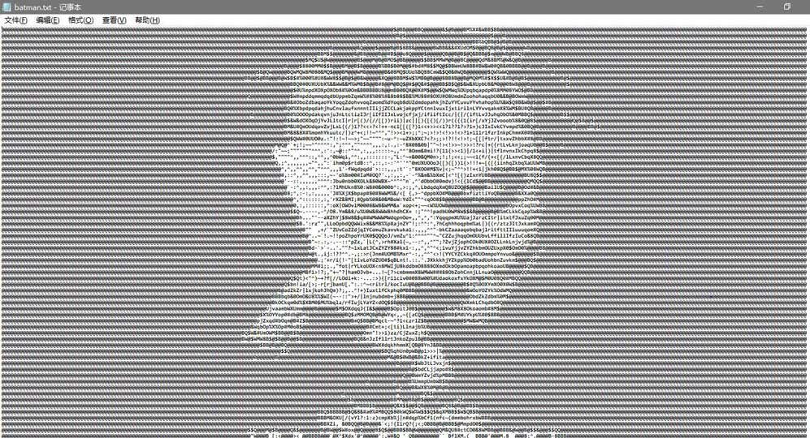

# Image-Text-Converter

这是一个使用 Python Pillow 的程序，能将图片转换成 ASCII 字符。

## 运行环境

需要安装 Pillow，没有安装可以运行：

```
python -m pip install pillow
```

安装完成后运行：

```
python image_converter.py
```

---

打开字符文件后，推荐设置记事本字体为以下属性：

* 字体 ( font-family ): Consolas
* 字形 ( font-weight ): Bold
* 字号 ( font-size ): 7px

---

## Demo

### 调试

利用渐变进行字符灰度调试


---

### 效果




---
